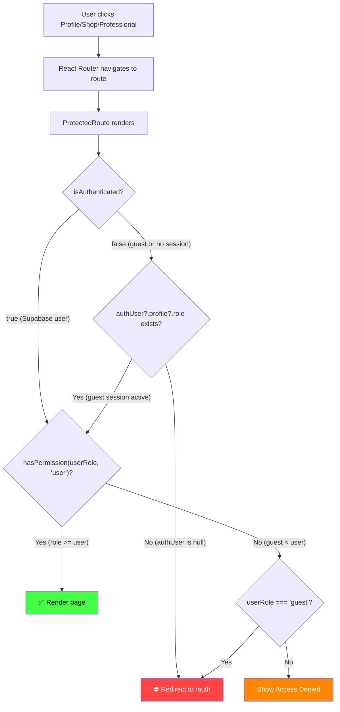

# 🔍 Navigation Redirect Bug — Root Cause Analysis

## Problem Summary

When a user clicks **Profile**, **Shop**, or **Professional** in the navigation sidebar, they are unexpectedly redirected to the **login page** (`/auth`) instead of seeing the requested page — even if they previously entered as a guest via "Continue as Guest".

---

## Affected Routes

| Route | Page | `requiredRole` | Redirects? |
|---|---|---|---|
| `/` | Dashboard | `guest` | ✅ Works |
| `/profile` | Profile | `user` | ❌ Redirects to `/auth` |
| `/quests` | Quests | `guest` | ✅ Works |
| `/shop` | Shop | `user` | ❌ Redirects to `/auth` |
| `/domain/:domain` | DomainView | `guest` | ✅ Works |
| `/professional` | Professional | `user` | ❌ Redirects to `/auth` |

> [!IMPORTANT]
> The pattern is clear: **every route that requires `requiredRole="user"` redirects to `/auth`**, while routes that require `requiredRole="guest"` work correctly.

---

## Root Cause Chain (3 Issues)

### 🔴 Root Cause #1: `ProtectedRoute` immediately redirects before checking role permissions

**File:** [ProtectedRoute.tsx](file:///e:/Project_Shinrai-levelup_system--main/src/components/ProtectedRoute.tsx#L20-L23)

```tsx
// Line 20-23 — The FIRST check in the component
if (!isAuthenticated && !authUser?.profile?.role) {
  return <Navigate to="/auth" state={{ from: location }} replace />;
}
```

This guard runs **before** the role-permission check at line 27. It checks two conditions joined by `&&`:

1. `!isAuthenticated` — Is the user NOT authenticated?
2. `!authUser?.profile?.role` — Does the auth user NOT have a profile role?

**The problem**: For **guest users**, `isAuthenticated` is explicitly set to `false` (see Root Cause #2 below). And while `authUser.profile.role` is `"guest"` — which is truthy — the entire condition still evaluates to `true` in certain timing scenarios where `authUser` is `null` (see Root Cause #3).

Even when the guest session IS properly set, this check is **logically wrong for guest-accessible routes**: a guest user with `isAuthenticated = false` AND `authUser.profile.role = "guest"` passes this check (because `!authUser?.profile?.role` is `false`), BUT then hits the role permission check below:

```tsx
// Line 26-27
const userRole = authUser?.profile?.role || 'guest';
const hasPermission = securityAPI.hasPermission(userRole, requiredRole);
```

For `requiredRole="user"`, the permission hierarchy check (`guest >= user`) returns `false`, causing a redirect at line 35-36:

```tsx
if (userRole === 'guest') {
  return <Navigate to="/auth" state={{ from: location }} replace />;
}
```

> [!CAUTION]
> **This is correct behavior for authenticated-only pages** — guests SHOULD be denied access to user-only pages. But the **real problem** is that the app has no intermediate state: you're either a Supabase-authenticated user or a guest, and there's no way for a guest to access user-level pages.

---

### 🔴 Root Cause #2: Guest users have `isAuthenticated = false` by design

**File:** [authSlice.ts](file:///e:/Project_Shinrai-levelup_system--main/src/store/slices/authSlice.ts#L19-L24)

```tsx
setAuthUser: (authUser: AuthUser | null) => {
  set({ 
    authUser, 
    isAuthenticated: !!authUser && authUser.id !== 'guest',  // ← Guest = false
    authLoading: false 
  });
},
```

When a guest session is created via [AuthPage.tsx L210-214](file:///e:/Project_Shinrai-levelup_system--main/src/pages/AuthPage.tsx#L210-L214):

```tsx
const handleGuestAccess = () => {
  const guestSession = authAPI.createGuestSession();
  setAuthUser(guestSession.user);  // user.id === 'guest'
  navigate('/');
};
```

The guest user object has `id: 'guest'`, so `authUser.id !== 'guest'` evaluates to `false`, which means `isAuthenticated` becomes `false`.

**Result**: Guest users are never "authenticated" in the store's eyes. This is intentional design, but it means guests cannot access any route guarded with `requiredRole="user"`.

---

### 🔴 Root Cause #3: `authUser` is NOT persisted across page loads

**File:** [store/index.ts](file:///e:/Project_Shinrai-levelup_system--main/src/store/index.ts#L90-L96)

```tsx
partialize: (state: ProdigyState) => ({
  user: state.user,          // ✅ Persisted
  skills: state.skills,      // ✅ Persisted
  quests: state.quests,      // ✅ Persisted
  shopItems: state.shopItems,// ✅ Persisted
  achievements: state.achievements // ✅ Persisted
  // ❌ authUser is NOT persisted
  // ❌ isAuthenticated is NOT persisted
  // ❌ authLoading is NOT persisted
})
```

The Zustand `persist` middleware uses `partialize` to select which state keys to save to `localStorage`. **`authUser` and `isAuthenticated` are NOT included**, so on every page load or refresh:

- `authUser` starts as `null`
- `isAuthenticated` starts as `false`
- `authLoading` starts as `true`

This means any navigation that triggers a full page render will show the loading spinner briefly, then the `initializeAuth` listener fires. **For guest users, there is no Supabase session to restore**, so `setupAuthListener` callback receives `authState.user = null`, and the guest state is lost.

---

## Contributing Factors

### 🟡 Factor #1: `initializeAuth` only restores Supabase sessions, not guest sessions

**File:** [authSlice.ts](file:///e:/Project_Shinrai-levelup_system--main/src/store/slices/authSlice.ts#L35-L52)

```tsx
initializeAuth: () => {
  setupAuthListener(async (authState) => {
    get().setAuthUser(authState.user); // null for guests!
    // ...
  });
}
```

**File:** [auth.ts](file:///e:/Project_Shinrai-levelup_system--main/src/lib/auth.ts#L284-L305)

```tsx
export const setupAuthListener = (callback: (authState: AuthState) => void) => {
  return supabase.auth.onAuthStateChange(async (_event, session) => {
    const authState: AuthState = {
      user: null,          // Default: null
      session,
      loading: false,
      isGuest: false
    };

    if (session?.user) {
      // Only populates authState.user if there's a real Supabase session
      const { data: profile } = await profileAPI.getProfile(session.user.id);
      authState.user = {
        ...session.user,
        profile: profile || undefined
      };
    }

    callback(authState);   // For guests: callback({ user: null, ... })
  });
};
```

The auth listener is backed by `supabase.auth.onAuthStateChange`, which only fires for **real Supabase auth events**. Guest sessions are purely client-side constructs and are not known to Supabase, so they're never restored.

---

### 🟡 Factor #2: Route definitions hardcode elevated role requirements

**File:** [App.tsx](file:///e:/Project_Shinrai-levelup_system--main/src/App.tsx#L47-L86)

```tsx
// These require "user" role — inaccessible to guests
<Route path="/profile"      element={<ProtectedRoute requiredRole="user">...} />
<Route path="/shop"          element={<ProtectedRoute requiredRole="user">...} />
<Route path="/professional"  element={<ProtectedRoute requiredRole="user">...} />

// These require "guest" role — accessible to everyone
<Route path="/"              element={<ProtectedRoute requiredRole="guest">...} />
<Route path="/quests"        element={<ProtectedRoute requiredRole="guest">...} />
<Route path="/domain/:domain" element={<ProtectedRoute requiredRole="guest">...} />
```

The role hierarchy in [securityAPI.hasPermission](file:///e:/Project_Shinrai-levelup_system--main/src/lib/auth.ts#L274-L280):
```tsx
const roleHierarchy = ['guest', 'user', 'premium', 'admin'];
// guest(0) < user(1) < premium(2) < admin(3)
```

A guest (`level 0`) can NEVER satisfy `requiredRole="user"` (`level 1`).

---

## Complete Flow Diagram



---

## Summary Table

| Issue | Type | File | Severity |
|---|---|---|---|
| Guest users are never "authenticated" (`isAuthenticated = false`) | Root Cause | [authSlice.ts](file:///e:/Project_Shinrai-levelup_system--main/src/store/slices/authSlice.ts#L22) | 🔴 High |
| `authUser` not persisted in Zustand store | Root Cause | [store/index.ts](file:///e:/Project_Shinrai-levelup_system--main/src/store/index.ts#L90-L96) | 🔴 High |
| `ProtectedRoute` treats guest as unauthorized for `user` routes | Root Cause | [ProtectedRoute.tsx](file:///e:/Project_Shinrai-levelup_system--main/src/components/ProtectedRoute.tsx#L21-L23) | 🔴 High |
| `initializeAuth` can't restore guest sessions | Contributing | [authSlice.ts](file:///e:/Project_Shinrai-levelup_system--main/src/store/slices/authSlice.ts#L35-L52) | 🟡 Medium |
| Profile/Shop/Professional hardcoded to `requiredRole="user"` | Contributing | [App.tsx](file:///e:/Project_Shinrai-levelup_system--main/src/App.tsx#L47-L86) | 🟡 Medium |

---

## What Needs to be Decided

> [!IMPORTANT]
> Before fixing, you need to decide on the **intended behavior**:

1. **Option A: Guests should be able to access Profile/Shop/Professional** (read-only or limited mode)
   - Change `requiredRole` from `"user"` to `"guest"` on those routes
   - Add in-page UI to prompt login for actions that require a real account

2. **Option B: Guests should be redirected but with a clear message**
   - Keep the current role requirements
   - Improve `ProtectedRoute` to show a user-friendly "Sign in to access this feature" modal instead of a hard redirect
   - Persist the guest `authUser` in Zustand so the guest session survives navigation

3. **Option C: Remove guest mode entirely**
   - Require all users to sign in/sign up
   - Remove the "Continue as Guest" button from `AuthPage`

Which approach would you like me to implement?
